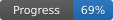

# Wii Party Recomp

Static recompilation of Wii Party for native PC.

> **Status:** The game boots, reaches the menu and has been played through a complete game of Board Game Island (17 rounds, to the final ranking and the save), controlled through an emulated Wii Remote, with sound from the game's own audio microcode, in the language of the Windows installation. Some elements are still missing. Overall progress is about 76% (estimate, see below).



## About

Wii Party Recomp is a project that aims to translate the original game executable into C++ source code that can be compiled natively, so the game can run on PC without an emulator.

## Current state

The game runs natively on Windows at a steady 60 fps (PAL60, the console setting; 50 fps with it off), using about one and a half CPU threads and 200 MB of memory. Input goes through an emulated Wii Remote: the mouse is the pointer and the keyboard gives the buttons and the motion. Checked by running the game with scripted input (`WP_INPUT_SCRIPT`): title, main menu, Board Game Island, number of players, Mii selection, CPU skill, the host explanation, the "Maze Daze" instruction screen, the minigame, the play order and the board turn screen.

### Progress

The overall figure is the equal-weight average of the components below. They are estimates, not measurements. The values live in `games/wiiparty/analysis/progress.csv` and `python tools/progress.py` regenerates the image.

| Component | Progress | Basis |
| --- | --- | --- |
| Recompilation toolchain | 95% | DOL and all 115 modules translate and build; module fixes still turn up and per-module correctness is unverified |
| System runtime | 91% | OS, threads, interrupts, decrementer and time base, GPU draw-done interrupt, the IPC hardware with IOS's measured file system timing, DVD, NAND (a first boot creates the save) and Bluetooth work; graphics on their own thread as on the separate Wii GPU; free of known blockers |
| Graphics (GX to Direct3D 11) | 85% | Menus, text, 3D models, lit Miis, integer TEV, indirect textures, fog, the hardware's blending rules, lines and points, vertex arrays in MEM2 EFB copies in every format including depth, the copy filter and gamma, and RGBA6 dithering; logic operations missing |
| Input | 65% | Emulated Wii Remote over emulated Bluetooth running the original WPAD/KPAD code; mouse as pointer, keyboard as buttons and as an accelerometer model (tilt, swing, shake) with the grip chosen per minigame; up to four gamepads (SDL3) as Wii Remotes 1-4 with gyroscope pointer, accelerometer, rumble and player lights, untested with a physical gamepad; no real Wii Remotes |
| Audio | 83% | The original AX microcode is recompiled to C++ with its hot instructions inline (checked instruction by instruction against Dolphin's DSP interpreter), runs in lockstep with the CPU and matches Dolphin's output sample for sample on the title music; no stale audio blocks on busy board scenes or scene loads; windowed-sinc WASAPI output |
| Game flow | 80% | A complete game of Board Game Island (17 rounds, final ranking, save) played by hand without faults; a first boot without a save works; 62 minigames played by hand in Free Play, 57 without faults seen (`docs/MINIGAMES.md`); pair games and the other modes not played through |
| PC features | 30% | A settings file for every PC option (read by a future launcher), borderless full screen with F11, 60 Hz through the console's PAL60 setting, the Windows cursor hidden over the game, the strap notice skipped, native resolution multiplier, 16:9 window, console language from Windows, an original icon and headless runs; launcher, options menu, ultrawide and online not started |

### Working

- **Recompilation:** the main executable (about 7,350 functions) and all 115 REL modules are translated to C++ and build into one native program of roughly 440 MB. Unit tests cover the translator; one game function is checked against the C++ standard library.
- **System:** Revolution OS initialisation, locked cache DMA, threads as Windows fibers (including the game's own `setjmp`/`longjmp` coroutines), video retrace, decrementer and GPU draw-done (PE finish) interrupts, OS alarms, module loading and linking, disc reads from the extracted files, the IPC hardware between the CPU and IOS with IOS's measured file system timing, and a virtual NAND (a first boot creates the save as on a console). Real Mii databases (`RFL_DB.dat`) load.
- **Graphics:** the GX command stream is decoded and drawn with Direct3D 11: vertex formats, transforms, a TEV ubershader with channel swap tables, display lists, draw batching, indexed skeleton matrices, texture decoding (I4, I8, IA4, IA8, RGB565, RGB5A3, RGBA8, C4, C8, C14X2, CMPR), blending, depth, scissor, EFB copies to textures, texture coordinates generated from normals with per-vertex texture matrices and the dual texture transform, and per-vertex color-channel lighting (adapted from Dolphin's software renderer, see `THIRD_PARTY_NOTICES.md`).
- **GPU thread:** as on the Wii, where the GPU is a separate chip, graphics commands are processed and drawn on their own thread while the CPU thread keeps running the game and answering interrupts (`WP_GPU_THREAD=0` processes them on the CPU thread, for debugging).
- **Window:** 16:9 when the virtual Wii is set to widescreen (the default, as in Dolphin), 4:3 otherwise; native internal resolution by default with an integer multiplier (`WP_SCALE`, 1 to 6), presented through a DXGI swap chain. The title bar shows the game, graphics API, region, frames per second and whether the DSP microcode runs recompiled (`NATIVE`) or on the interpreter (`INTERP`) with its share of the CPU thread; its texts are in `engine/src/platform/ui_text.cpp`, ready for other languages.
- **Diagnostics:** `WP_DSP_VERIFY` (replays every recompiled DSP run on Dolphin's interpreter and compares, with a coverage count), `WP_DSP_SELFTEST=N` (runs every instruction of the recompiled microcode from N random states against the interpreter and exits), `WP_DUMP_AUDIO` / `WP_DUMP_OUTPUT` (WAV of the emulated audio / of what goes to the speakers), `WP_LOG_FILE` (timestamped log of fps, slow frames, CPU and GPU thread load with the guest's idle share, audio, disc reads, modules and IOS opens), `WP_LOG_GX`, `WP_LOG_FPS`, `WP_LOG_IOS`, `WP_LOG_IRQ`, `WP_LOG_INPUT`, `WP_LOG_DISC`, `WP_PROFILE`, `WP_RECONNECT_ON_POINTER` (0 stops mouse movement from waking a disconnected Wii Remote), `WP_VIRTUAL_GAMEPADS=N` (N virtual SDL gamepads that press the bottom button every 3 s, logging rumble and player lights) and `WP_VIRTUAL_GAMEPADS_UNTIL=ms` (unplugs them at that time), `WP_COPY_FILTER=0` (turns off the vertical anti-flicker filter the game programs for its copies, for a sharper picture; on by default, as on a Wii), `WP_POLL_INTERVAL` (loop back-edges between interrupt and audio checks, 1024 by default), `WP_WATCH`, `WP_DUMP`, `WP_SAVE_FRAME`, F12 in the game window (saves every GPU draw of the next frame, with the registers it changes and its first vertices, to `captures/gx_capture_NNN.txt` plus the frame as `gx_capture_NNN.png`, every EFB copy to a texture as `gx_capture_NNN_copyK.png` with the EFB just before it as `gx_capture_NNN_copyK_efb.png`, and where each texture of the frame came from (an EFB copy or RAM) in `gx_capture_NNN_textures.txt`; `WP_CAPTURE_AT=seconds,...` does the same at those times), a crash reporter with guest registers and call stacks, and a GDB client for Dolphin (`tools/dolphin_gdb.py`).

### Controls

| Wii Remote | Keyboard and mouse | Gamepad, remote upright | Gamepad, remote sideways |
| --- | --- | --- | --- |
| Pointer | Mouse over the window | Gyroscope or right stick; R3 recenters | Same |
| A | Enter, Space or left click | Bottom face button or R1 | Top face button or R1 |
| B | Backspace or right click | Right face button or R2 | R2 |
| 1 | 1 | Left face button | Left or right face button |
| 2 | 2 | Top face button | Bottom face button |
| + / - | + / - | Start / Back (Options / Share, Menu / View) | Same |
| HOME | H | Guide (PS, Xbox, Home) | Same |
| D-pad | Arrow keys; sideways, W, A, S, D as seen on screen | D-pad or left stick, as seen on screen | Same |
| Tilt | Q / E, R / F | Tilt the gamepad | Same |
| Swing up / down | Mouse wheel, or T / G | Move the gamepad sharply | Same |
| Shake | Middle click or left Shift | Shake the gamepad | Same |
| Swap upright and sideways | Tab | Tab | Tab |

The emulated remote is held upright, or sideways in the 37 minigames whose instructions ask for it (read from the game's own control texts), so the tilt keys and the gamepad buttons always follow the screen; Tab swaps it if a screen ever needs the other grip (`WP_AUTO_ORIENTATION=0` turns the automatic choice off). The console language follows Windows (English, German, French, Spanish, Italian or Dutch); `WP_LANGUAGE=en|de|fr|es|it|nl` forces one.

Face buttons follow the letters printed on the gamepad: on Nintendo-layout gamepads (A on the right, B at the bottom) the A button is the Wii Remote's A. Gamepads: the first gamepad adds to the keyboard and mouse as Wii Remote 1, and the second, third and fourth are Wii Remotes 2, 3 and 4. As on a Wii, a remote connects when one of its buttons is pressed, and unplugging the gamepad disconnects it. The gamepad vibrates when the game makes the Wii Remote rumble, and gamepads with player lights show the remote's number. The gyroscope recalibrates itself whenever the gamepad is held still for a second; R3 recenters the pointer. `WP_GAMEPAD=0` turns gamepads off.

### Known problems

- Mii lighting now works, but it has not been compared with Dolphin or the real console, and whether the Mii faces show block artifacts at higher resolutions has not been checked. The Mii faces that came out black or pale in House Party are fixed; other screens with Miis have not all been checked.
- Some Miis are drawn with a different mouth (for example with lips) in a minigame than on the board or in the results.
- A few minigames show graphics faults; `docs/MINIGAMES.md` lists every minigame checked by hand.
- Some minigames may still be drawn incorrectly; not all have been checked.
- Entering the main menu still causes one frame of about 60 ms, while the game decompresses about 40 files and draws its first menu frame (on a real Wii this frame is slower). Minigame sound has not been checked.

### Not implemented

- Real Wii Remotes. Gamepad support (through SDL3) has not yet been tested with a physical gamepad.
- GX: logic operations (not used by any screen checked so far), texture offsets of lines and points.
- Planned: ultrawide display support, higher frame rates, a launcher and options menu, online play, quality-of-life options and a Galician translation.

Progress notes and the list of goals are in `docs/DECOMP_PROGRESS.md`; the manual check of every minigame is in `docs/MINIGAMES.md`; planned features are in `docs/FEATURES_QOL.md`.

## Repository layout

The project is split into a reusable Wii engine and one folder per game, so other Wii games can be recompiled with the same tools.

| Folder | Contents |
| --- | --- |
| `engine/` | The Wii engine in C++, shared by every game: `src/core` (CPU runtime, threads, interrupts, modules, boot), `src/gpu` (GX), `src/audio` (DSP and audio output), `src/ios` (IPC, IOS, NAND, disc), `src/input` (Bluetooth, Wii Remote, keyboard, gamepads), `src/platform` (window and text), `src/app` (the program entry point), `include/wp` (headers) and `res` (Dolphin's free DSP ROMs). |
| `recompiler/` | The PowerPC and DSP recompilers in Python, shared by every game: `ppc` (decoder and C++ emitter), `dsp` (DSP microcode), the DOL and REL readers, and `game.py`, which reads a game's `game.toml` and gives every tool its paths. |
| `games/wiiparty/` | Everything specific to Wii Party: `game.toml` (name, ID, SDK addresses), `game.cpp` (window title, default folders, minigames played sideways), `analysis/` (function lists, symbols, replaced functions, DSP microcode list, progress), `res/` (icon) and `CMakeLists.txt` (the executable). Local, ignored by Git: `disc/` (your dump), `extracted/` (the extracted disc) and `nand/` (settings and saves). |
| `tools/` | Development utilities: SDL3 download, icon, progress badge, Ghidra import and decompilation, Dolphin GDB client. |
| `tests/` | `engine/` (runtime tests), `recompiler/` (PowerPC decoder and emitter tests), `wiiparty/` (tests on the recompiled game code). |
| `third_party/` | Code from other projects, kept apart with its licences (see `THIRD_PARTY_NOTICES.md`). |
| `ghidra/scripts/` | Ghidra scripts. |
| `docs/` | Progress notes (`DECOMP_PROGRESS.md`), the minigame check (`MINIGAMES.md`), planned features (`FEATURES_QOL.md`) and the progress badge. |
| `build/` | Generated, ignored by Git: `deps/` (SDL3), `out/` (compiled program and tests) and `<game>/` (unpacked modules, symbols and the generated C++ in `generated/dol`, `generated/modules/<module>` and `generated/dsp`). |
| `captures/` | F12 captures, ignored by Git. |

To add another game: create `games/<name>/` with its `game.toml`, `game.cpp`, `analysis/`, `res/` and `CMakeLists.txt`, then run the tools with `WP_GAME=<name>` and configure CMake with `-DWP_GAME=<name>`.

## Settings

Every PC improvement can be turned on or off in `games/wiiparty/settings.ini`, created with the defaults on the first start (ignored by Git). The recompiled game code does not read it; only the engine's PC layer does, so a launcher can edit the file. An environment variable, where listed, overrides the file.

| Setting | Default | Effect | Variable |
| --- | --- | --- | --- |
| `[video] scale` | `1` | Internal resolution multiplier, 1 to 6 | `WP_SCALE` |
| `[video] fullscreen` | `0` | Borderless full screen; F11 toggles it and saves the choice | `WP_FULLSCREEN` |
| `[video] copy_filter` | `1` | The anti-flicker filter the game programs for its EFB copies (0 gives a sharper picture) | `WP_COPY_FILTER` |
| `[input] gamepads` | `1` | Gamepads as Wii Remotes | `WP_GAMEPAD` |
| `[input] auto_grip` | `1` | Hold the emulated remote sideways in the minigames that ask for it | `WP_AUTO_ORIENTATION` |
| `[input] wake_on_mouse` | `1` | Moving the mouse reconnects a remote the game disconnected for inactivity | `WP_RECONNECT_ON_POINTER` |
| `[input] hide_cursor` | `1` | Hide the Windows cursor over the game window (the game draws its own pointer) | `WP_HIDE_CURSOR` |
| `[system] language` | `auto` | Console language: `auto` follows Windows, or `en`, `de`, `fr`, `es`, `it`, `nl` | `WP_LANGUAGE` |
| `[system] pal60` | `1` | The console's own PAL60 setting (`IPL.E60`), so the PAL game runs at 60 Hz; 0 gives 50 Hz | `WP_PAL60` |
| `[system] skip_notices` | `1` | Press A on the Wii Remote strap notice at start, as a player would, to reach the title sooner | `WP_SKIP_NOTICES` |
| `[audio] mute` | `0` | Silence the output | `WP_MUTE` |

## Setup

Requirements: Git, CMake, Ninja, a C++ compiler (GCC/MinGW-w64 or MSVC), Rust (for `nodtool`), Python 3, JDK 21+, [Ghidra](https://github.com/NationalSecurityAgency/ghidra/releases) 12.x unpacked into `ghidra/install/` and the Ghidra GameCube Loader extension (Apache-2.0, provides the `Gekko_Broadway` processor with paired singles) installed in Ghidra.

1. Install the disc tool:

   ```
   cargo install nodtool
   ```

2. Put your own dump of Wii Party in `games/wiiparty/disc/` (ISO, WBFS, RVZ or CISO; e.g. `games/wiiparty/disc/wiiparty.rvz`).
3. Extract it:

   ```
   nodtool extract games/wiiparty/disc/wiiparty.rvz games/wiiparty/extracted
   ```

   The recompiler inputs are `games/wiiparty/extracted/sys/main.dol` and the LZ11-compressed modules in `games/wiiparty/extracted/files/rel/*.rel.lz`; assets live in the rest of `games/wiiparty/extracted/files/`.

4. Unpack the REL modules and import the DOL into Ghidra. Optionally, name the functions first: in Dolphin, run the game, use Symbols > Generate Symbols From > Signature Database, then save the symbol map as `reference/symbols/SUPP01.map`.

   ```
   python recompiler/unpack_rels.py
   python recompiler/import_map.py
   python tools/ghidra_import.py
   ```

   Unpacked modules go to `build/wiiparty/rel/`, the converted symbol names to `build/wiiparty/symbols/dolphin_symbols.csv` and the Ghidra project to `ghidra/projects/`. The symbol map stays local and is never committed.

5. Generate the C++ from the DOL, build it and run the tests:

   ```
   python tools/fetch_sdl.py
   python recompiler/recomp.py
   python recompiler/dsp/recomp_dsp.py
   cmake -S . -B build/out -G Ninja -DCMAKE_BUILD_TYPE=Release
   cmake --build build/out
   ctest --test-dir build/out
   ```

   `tools/fetch_sdl.py` downloads the SDL3 3.4.16 development files (checked by SHA-256) into `build/deps/` for gamepad support; without them the build still works, with keyboard and mouse only, and with them `SDL3.dll` is copied next to the executable. `recompiler/recomp.py` reads `games/wiiparty/analysis/dol_functions.csv` and writes the generated sources to `build/wiiparty/generated/dol/`. `recompiler/dsp/recomp_dsp.py` extracts the audio DSP microcode listed in `games/wiiparty/analysis/dsp_ucode.csv` from the DOL and translates it to C++ in `build/wiiparty/generated/dsp/`; without it the DSP runs on the interpreter. Game modules are translated separately with `python recompiler/recomp_rel.py boot menu` (or `--all`, which produces about 650 MB of C++ and takes several minutes to compile) into `build/wiiparty/generated/modules/`; run `recompiler/recomp.py` again afterwards so the DOL provides every function the modules call.

   Run the result with `build/out/wiiparty` from the repository folder; optional arguments are `[extracted disc folder] [seconds] [nand folder]`, by default `games/wiiparty/extracted`, no limit and `games/wiiparty/nand`. It opens a window that shows the console framebuffer; `seconds` is an optional watchdog that stops the process after that long (0 or omitted means no limit) and `WP_HEADLESS=1` runs without a window. The virtual NAND (settings and saves) lives in `games/wiiparty/nand`.

6. Optional, to drive Ghidra from an MCP client: create the virtual environment and install the bridge.

   ```
   uv venv .venv
   uv pip install --python .venv/Scripts/python.exe -r tools/requirements.txt
   ```

   The [GhidraMCP](https://github.com/bethington/ghidra-mcp) 6.0.0 extension must be unpacked into `%APPDATA%\ghidra\ghidra_12.1.3_PUBLIC\Extensions\` and enabled in Ghidra. Its server listens on `http://127.0.0.1:8089`.

7. Optional, to compare against a real Dolphin: add `GDBPort = 2159` under `[General]` in Dolphin's `Dolphin.ini`, then drive it with the bundled GDB client:

   ```
   python tools/dolphin_gdb.py --launch "break 80069ee0" "continue 40" "regs pc lr r1 r3" "mem 80000000 32"
   ```

   Commands are `regs`, `mem`, `u32`, `write`, `break`, `unbreak`, `watch`, `rwatch`, `awatch`, `step`, `continue`, `halt`, `raw` and `sleep`. Dolphin accepts one client per boot, so each call starts a fresh emulator (`--launch`; `--keep` leaves it running). It expects `reference/dolphin/Dolphin.exe` and `games/wiiparty/disc/wiiparty.rvz` unless `--dolphin` and `--game` are given.

`games/wiiparty/disc/`, `games/wiiparty/extracted/`, `games/wiiparty/nand/` and `reference/` (optional local material such as an emulator and RAM dumps of your own copy) are ignored by Git and must never be committed.

## Legal notice

This project does not include any copyrighted assets, game code or binaries from Nintendo. You must provide your own legally obtained copy of Wii Party. This project is not affiliated with or endorsed by Nintendo.

Releasing the project's own code under the GPL does not make Nintendo's original resources (executables, textures, models, sounds, fonts, videos) redistributable, and it grants no rights over them.

## Contributing

Issues and pull requests are welcome. Please do not share or upload copyrighted game files anywhere in this repository, including issues and pull requests.

## License

The original code of this project is licensed under the GNU General Public License, version 3 or (at your option) any later version (GPL-3.0-or-later). See [LICENSE](LICENSE). Copyright (C) 2026 Arel Kair.

The project may incorporate third-party components under their own licenses, which must be respected. [THIRD_PARTY_NOTICES.md](THIRD_PARTY_NOTICES.md) records what has been reviewed and what is still pending. The only third-party code included so far is the GX lighting adapted from the Dolphin Emulator (GPL-2.0-or-later); no complete license audit has been done.
